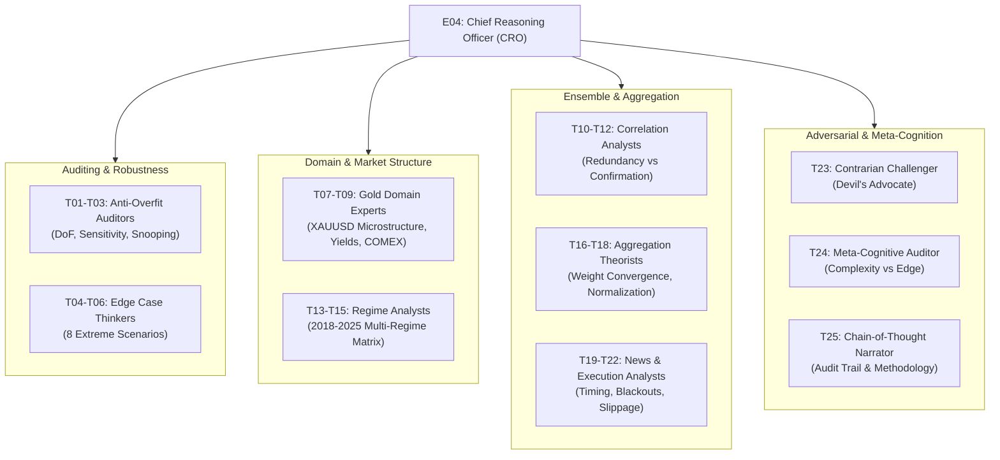
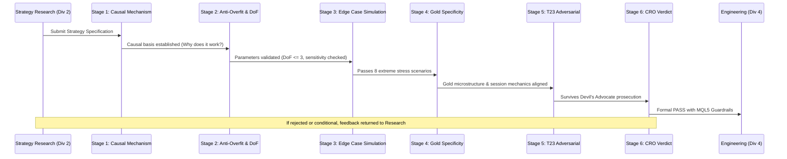
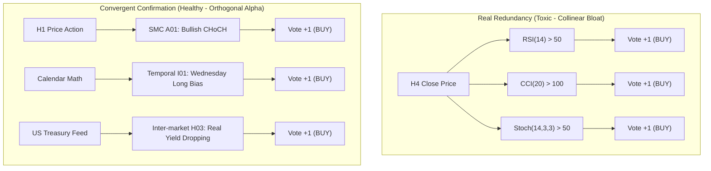
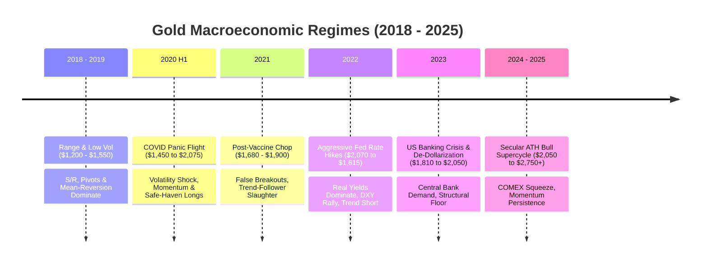
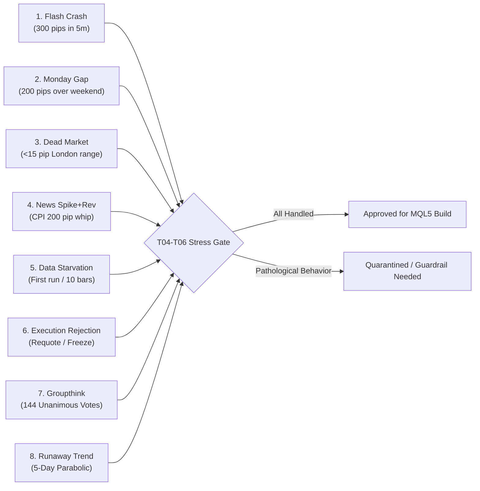
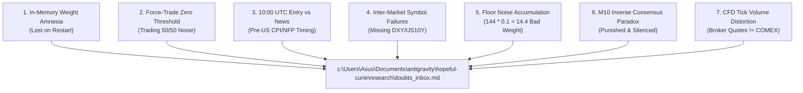

# Gold Oracle EA v2 — Chief Reasoning Officer (CRO) Protocol
## Deep Reasoning Division Directive & Anti-Overfit Architecture

**Author**: E04 — Chief Reasoning Officer (CRO)  
**Division**: Division 3 (Deep Reasoning — 25 Specialized Agents)  
**Project**: Gold Oracle EA v2 (XAUUSD Daily Directional 140+ Brain Multi-Agent Engine)  
**Classification**: Executive Quantitative Strategy & Risk Protocol  
**Date**: 2026-10-01  
**Status**: ACTIVE / MANDATORY PRE-CODE GATE  

---

## 1. Executive Mandate & Philosophy

> *"The most expensive bugs in quantitative trading are never compiler errors or null pointer exceptions — they are design bugs. A strategy that sounds brilliant in backtest literature but fails in live forward execution costs far more than never implementing it. We do not write code to see if an idea works; we think, stress-test, and adversarially falsify an idea until only undeniable quantitative truth remains."*  
> — **E04, Chief Reasoning Officer**

The Deep Reasoning Division serves as the **intellectual conscience and pre-code gatekeeper** of the Gold Oracle EA. While Strategy Research (Division 2) discovers and formulates concepts, and Engineering (Division 4) writes MQL5, the Deep Reasoning Division commands 25 reasoning specialists whose sole purpose is to **interrogate, challenge, stress-test, and de-bias** every brain before a single line of MQL5 is committed.

### Division Command Structure (25 Agents)



### Deep Reasoning Division Agent Roster

| Agent IDs | Role Designation | Primary Responsibility | Key Output Gate |
|---|---|---|---|
| **T01 - T03** | Anti-Overfit Auditors | Parameter degrees of freedom, curve-fitting detection, sensitivity testing | Overfit Risk Score & Parameter Clearance |
| **T04 - T06** | Edge Case Thinkers | Mental simulation under 8 extreme market shocks | Edge Case Resilience Verdict |
| **T07 - T09** | Gold Domain Experts | Alignment with physical bullion, yields, safe-haven dynamics, session flows | Gold Specificity Gate |
| **T10 - T12** | Correlation Analysts | Pairwise signal correlation, category bloat prevention, cluster identification | Redundancy Matrix & Dampening Factors |
| **T13 - T15** | Regime Analysts | Stress testing across 2020 COVID, 2022 Fed rate hikes, 2024 ATH regimes | Regime Robustness Vector |
| **T16 - T18** | Aggregation Theorists | Mathematical integrity of weighted sum, floor noise, weight decay dynamics | Weight Aggregation Protocol |
| **T19 - T22** | News & Execution Analysts | 10:00 UTC entry timing vs high-impact releases, pre-news price contamination | News Gate & Timing Safeguards |
| **T23** | Contrarian Challenger | Adversarial prosecution; finding reasons why the entire architecture will fail | Devil's Advocate Doubt Docket |
| **T24** | Meta-Cognitive Auditor | Preventing "complexity monument" syndrome; distilling core signal from noise | Simplicity & Edge Defense |
| **T25** | Chain-of-Thought Narrator | Formal documentation of reasoning trajectories, trade-offs, and decisions | Master Reasoning Log |

---

## 2. The 6-Stage Chain-of-Thought (CoT) Auditing Protocol

Every proposed brain function from Strategy Research ($A01 - M10$) must navigate a mandatory 6-stage CoT audit before passing to Engineering. Failure at any stage triggers immediate return with explicit revision requirements or formal rejection.



### Stage 1: Causal Mechanism Verification (First Principles)
- **Question**: *What is the underlying economic, psychological, or mechanical reason why this strategy generates alpha on Gold?*
- **Test**: Does it exploit:
  1. Structural institutional order flow (e.g., Central bank accumulation, London Fix liquidity)?
  2. Behavioral panic / greed asymmetry (e.g., safe-haven flight, retail stop cascades)?
  3. Physical/Arbitrage constraints (e.g., COMEX delivery spreads, ETF creation/redemption)?
- **Disqualification Criteria**: Any strategy whose sole justification is "indicator X crossed indicator Y on historical backtests" with no structural economic foundation is instantly classified as an empirical artifact and rejected.

### Stage 2: Anti-Overfit & Parameter Sensitivity Audit
- **Degrees of Freedom (DoF)**:
  - $\le 1$ parameter: **SAFE** (e.g., standard RSI 14, EMA 200).
  - $2 - 3$ parameters: **ACCEPTABLE** with rigorous justification.
  - $\ge 4$ parameters: **CRITICAL RISK** — automatic rejection unless partitioned into un-tuned physical constants.
- **Sensitivity Perturbation Test**:
  - The strategy parameters must undergo $\pm 20\%$ perturbation (e.g., RSI period shifted to 11 and 17; EMA shifted to 40 and 60).
  - If the logical thesis or signal validity collapses upon a $\pm 10-20\%$ parameter shift, the strategy is deemed curve-fitted to a narrow historical sample and rejected.
- **Data Snooping Defense**: Was the strategy conceived independently of 2020-2024 Gold price data? Strategies invented specifically because "it worked great in 2023" are disqualified.

### Stage 3: Quantitative Edge Case Mental Simulation
- The brain is mentally walked through the **8 Core Stress Scenarios** (detailed in Section 6).
- Every brain must demonstrate non-pathological behavior:
  - If data is corrupted or insufficient $\to$ must return `0` (neutral), never random votes.
  - During flash crashes or spread blowouts $\to$ must not chase falling knives or enter at un-fillable prices.
  - Bar lookbacks must strictly reference closed bars (`bar[1]`), completely immune to intra-bar repainting.

### Stage 4: Gold Specificity & Microstructure Filter
- **Tick Volume vs Real Volume**: Gold CFDs stream broker tick volume, NOT physical exchange volume. If a volume strategy (Category E) relies on subtle tick-volume divergence, it must be robust to broker quote frequency variances.
- **Session Liquidity Alignment**: Gold Oracle enters at **10:00 UTC**. The strategy must evaluate:
  - Asian range ($00:00 - 07:00$ UTC) accumulation/distribution.
  - London open ($07:00 - 10:00$ UTC) initial expansion or liquidity grab.
  - How the brain's 10:00 UTC signal projects into the volatile New York session ($13:00 - 17:00$ UTC) where $65\%$ of daily range is realized.
- **Pip & Point Mechanics**: Standardized to `_Digits = 2`, `_Point = 0.01`, where $1\text{ pip} = \$0.01$ (or $\$0.10$ depending on broker convention, normalized via `pipFactor`).

### Stage 5: Adversarial Challenge (T23 Devil's Advocate)
- Agent T23 acts as lead prosecutor against the strategy:
  - Identifies the worst-case market scenario that bankrupts the strategy.
  - Probes for correlated failure modes with other approved brains.
  - Demands proof that the strategy is not redundant with existing MAs or momentum oscillators.

### Stage 6: Formal Gate Verdict & Guardrail Specification
The CRO issues one of three verdicts:
1. **PASS**: Approved for engineering as specified.
2. **CONDITIONAL PASS**: Approved ONLY with mandatory hardcoded MQL5 guardrails (e.g., ATR volatility bounds, minimum bar count checks, spread thresholds).
3. **REJECT**: Returned to Strategy Research or discarded.

---

## 3. Anti-Overfit Audit Framework

### 3.1 Parameter Degrees of Freedom (DoF) Rules
Curve-fitting is the number one cause of algorithmic trading failure. When an algorithm fits historical noise, forward performance decays catastrophically.

$$\text{P-Value Penalty} \propto \prod_{i=1}^{k} (\text{Parameter Range}_i)$$

To ensure statistical validity, Gold Oracle enforces the **Standardization Hierarchy**:

1. **Tier 1 (Universal Constants - Zero Optimization Allowed)**:
   - Moving Averages: Standard Fibonacci / Institutional lengths only: `20`, `50`, `100`, `200`.
   - Oscillators: Standard baseline periods: RSI `14`, MACD `12/26/9`, Stochastic `%K=14, %D=3, Slowing=3`, CCI `20`.
   - Bollinger Bands: Period `20`, Deviations `2.0`.
   - ATR: Period `14`.
2. **Tier 2 (Structural Rules - Zero Tunable Parameters)**:
   - SMC/ICT Swings: Standard 3-bar or 5-bar pivot detection.
   - Price Action: Open, High, Low, Close geometric relations (e.g., Inside Bar, Engulfing).
   - Time Windows: Fixed exchange hours (Asian 00-07 UTC, London 07-10 UTC, NY 13-17 UTC).
3. **Tier 3 (Tunable Thresholds - Max 1 Per Brain)**:
   - Any threshold (e.g., Z-score critical value $> 2.0$, ADX trend filter $> 25$) must be grounded in textbook statistical theory (e.g., $95\%$ confidence interval), NEVER tuned to optimize backtest equity curves.

### 3.2 Parameter Sensitivity & Stability Protocol
Before code sign-off, every brain with an adjustable threshold $\theta$ must pass the **Neighborhood Stability Test**:

$$\left| \frac{\text{WinRate}(\theta + \Delta) - \text{WinRate}(\theta)}{\text{WinRate}(\theta)} \right| \le 0.15 \quad \text{for } \Delta = \pm 20\%$$

If a strategy shows a knife-edge profit peak at $\theta = 1.74$ that drops into steep losses at $\theta = 1.50$ or $\theta = 2.00$, it is a mathematical certainty that the parameter is overfit to historical sample noise. Such strategies are summarily rejected.

### 3.3 Sample Size & Statistical Significance Requirements
Given Gold Oracle's daily trading horizon (~250 trading days per year, ~500 days per 2-year sample):
- **High-Frequency Daily Voter**: Produces signals on $\ge 50\%$ of trading days ($125-250$ signals/year). High statistical confidence.
- **Conditional / Structural Voter**: Produces signals on $20-50\%$ of trading days ($50-125$ signals/year). Acceptable for regime-specific brains (e.g., breakouts, reversals).
- **Rare Event Voter**: Produces signals on $< 10\%$ of days ($< 25$ signals/year). 
  - *CRO Rule*: Any brain generating fewer than $25$ signals per year cannot be validated out-of-sample within a 2-year period ($N$ is too small for statistical power: $t = \frac{\bar{x} - \mu}{s / \sqrt{N}}$). Rare event brains must be merged into broader structural categories or eliminated.

### 3.4 Out-of-Sample Walk-Forward Integrity
- **In-Sample Optimization Window**: 2018-01-01 to 2021-12-31 (Encompasses low-vol range and 2020 COVID shock).
- **Out-of-Sample Validation Window 1 (Inflation & Rate Hike Stress)**: 2022-01-01 to 2022-12-31 (Severe bear market).
- **Out-of-Sample Validation Window 2 (Secular ATH Bull Market)**: 2023-01-01 to 2024-12-31.
- *Strict Mandate*: Zero parameters may be modified between in-sample and out-of-sample testing. If an indicator fails during the 2022 Fed rate hike regime, it cannot be "re-tuned"; its failure must be naturally managed by adaptive weighting or an explicit macroeconomic regime filter.

---

## 4. Redundancy Analysis & Bloat Prevention Protocol

### 4.1 The Category Bloat Threat
A critical flaw in naive multi-strategy ensembles is **unintentional collinear vote stacking**.

Consider the proposed 144 brain distribution:
- **Momentum & Oscillators**: 16 brains
- **Trend Following**: 15 brains
- **Inter-Market**: 16 brains
- **Statistical**: 15 brains
- **Temporal**: 15 brains
- **SMC/ICT**: 12 brains
- **Candlestick**: 12 brains
- **Volatility**: 11 brains
- **Volume**: 10 brains
- **Fibonacci**: 10 brains
- **Pivot/S-R**: 10 brains
- **Experimental**: 10 brains
- **Psychological**: 8 brains

> [!WARNING]
> **The Oscillator Trap**:
> If Brain C01 (RSI), C05 (Stoch), C06 (CCI), C07 (%R), C08 (MFI), C09 (QQE), C11 (ROC), C12 (AO), and C14 (RSI-EMA) all measure price velocity relative to range, a strong 3-day rally will cause all 9 brains to vote identical +1 (or -1 if overbought). They represent **one single underlying market factor (Momentum)** masquerading as 9 independent votes, creating 9x synthetic voting power that swamps the entire Psychological category (8 brains).

### 4.2 Distinguishing Real Redundancy vs Convergent Confirmation



- **Real Redundancy**: Multiple indicators derived from the exact same price series ($X_t$) using nearly identical mathematical smoothing transformations (e.g., EMA 20/50 cross vs MACD line cross vs Price > SMA 50). Expected pairwise correlation $> 0.85$.
- **Convergent Confirmation**: Multiple independent data sources or completely distinct analytical dimensions arriving at the same directional conclusion (e.g., structural price pattern + inter-market yield divergence + calendar seasonality). Expected pairwise correlation $< 0.45$.

### 4.3 Pairwise Agreement Matrix & Action Rules

For any pair of brains $(B_i, B_j)$, we compute their historical Signal Agreement Rate:

$$\text{Agreement}(B_i, B_j) = \frac{\sum_{t=1}^{T} \mathbb{I}(v_{i,t} = v_{j,t} \land v_{i,t} \neq 0)}{\sum_{t=1}^{T} \mathbb{I}(v_{i,t} \neq 0 \lor v_{j,t} \neq 0)}$$

| Agreement Rate | Classification | Action Mandate |
|---|---|---|
| **$\ge 90\%$** | **Identical / Redundant** | **ELIMINATE or MERGE**. Only the cleanest, lowest-latency brain is retained. The second is purged. |
| **$75\% - 89\%$** | **Collinear / High Overlap** | **APPLY DAMPENING FACTOR**. Scale base weight of both brains by $0.70$ to prevent double-counting. |
| **$45\% - 74\%$** | **Related / Complementary** | **RETAIN AS-IS**. Healthy balance of confirmation and differentiation. |
| **$< 45\%$** | **Orthogonal / Independent** | **PRIME ASSETS**. True portfolio diversification; receive full baseline weighting ($1.0$). |
| **Negative ($< 0$)**| **Contrarian Pair** | **PRESERVE FOR HEDGING**. (e.g., Trend vs Mean Reversion). Crucial for multi-regime survival. |

### 4.4 Category-Normalized Aggregation Architecture
To structurally solve the category size imbalance where Momentum (16) and Inter-Market (16) overpower Psychological (8) or Volume (10), the CRO establishes the **Two-Tier Category-Normalized Voting Model**:

#### Standard Flat Aggregation (Vulnerable to Bloat):
$$S_{\text{raw}} = \sum_{i=1}^{144} w_i \cdot v_i$$

#### Category-Normalized Aggregation (CRO Mandate):
Each of the $K = 13$ categories produces a normalized category score $C_k \in [-1.0, +1.0]$:

$$C_k = \frac{\sum_{i \in \text{Cat}_k} w_i \cdot v_i}{\sum_{i \in \text{Cat}_k} w_i \cdot |v_i| + \epsilon}$$

The final master composite score $S_{\text{master}}$ is the weighted consensus of the 13 categories:

$$S_{\text{master}} = \sum_{k=1}^{13} \Omega_k \cdot C_k$$

Where $\Omega_k$ is the macro category weight (default $\Omega_k = 1.0$), ensuring that each market dimension contributes equally to the daily consensus, regardless of whether a category contains 8 or 16 brains.

---

## 5. Gold Market Regime Shift Matrix

Gold behaves fundamentally differently across macroeconomic regimes. A strategy optimized in a trending bull market will suffer severe drawdowns during stagflationary chop or aggressive rate-hiking cycles.



### Comprehensive Regime Stress Matrix

| Regime ID & Name | Macro Drivers & Market Dynamics | Price Action & Volatility Profile | Outperforming Brain Categories (+EV) | Underperforming / Vulnerable Brains (-EV) | Required Adaptive Weight Response |
|---|---|---|---|---|---|
| **Regime 1: 2018-2019 Low-Vol Compression** | Fed pausing, calm economy, low inflation. Real yields stable. | Tight range ($1,200 - $1,550). ATR(H1) $\approx 20-35$ pips. Low liquidity impulse. | **Category J (Pivots/SR)**, **Category G (Statistical Z-Score)**, **Category D (BB Mean Rev)**. | Category B (Trend Following) chopped constantly. Category A (SMC Breakouts) suffer false breaks. | Suppress Trend weights down to $0.2-0.5$. Boost Mean Reversion and Pivot weights to $1.5-2.0$. |
| **Regime 2: 2020 H1 COVID Liquidity Shock** | Global pandemic shutdown. Initial dash for cash (all assets drop), followed by unlimited QE / zero rates. | Extreme volatility. V-bottom from $1,450 \to \$2,075$. ATR(H1) $> 150$ pips. 300-pip single-day moves. | **Category B (Trend/Momentum)**, **Category C (Oscillator continuation)**, **Category H (Real Yield collapse)**. | Category G (Mean reversion / Z-score) crushed by relentless parabolic extensions. | Dynamic ATR SL multiplier expansion. Suppress counter-trend mean reversion. |
| **Regime 3: 2021 Choppy Post-Vaccine Reflation** | Vaccine rollout, economic reopening, transition from deflation to inflation fears. Fed insists inflation is "transitory". | Sideways whip-saw between $1,680 and $1,900$. Multiple false breakouts of H4/D1 ranges. | **Category K (Candlestick Reversals)**, **Category A (Liquidity Sweeps / EQH/EQL)**, **Category J (Camarilla S/R)**. | Category B (Trend following) suffered severe drawdowns. Classic moving average crossovers generated 70% false signals. | High weight damping on trend continuation. Elevate liquidity sweep and failed breakout detectors. |
| **Regime 4: 2022 Fed Rate Hiking Shock** | Fed launches fastest rate hike cycle in 40 years (+450 bps). US 10-year real yields surge from $-1.0\%$ to $+1.5\%$. DXY hits 114. | Prolonged 8-month downtrend from $2,070 \to \$1,615$ (-22%). Lower highs, heavy institutional selling. | **Category H (Inter-Market: DXY & US10Y)**, **Category B (Trend Following Short)**, **Category G (Autocorrelation)**. | "Safe-haven" dip-buyers ruined. Traditional Gold bugs long-bias destroyed. Psychological bounce buyers trapped. | Inter-market brains must dominate. Directional bias must cleanly flip short without long-side anchoring. |
| **Regime 5: 2023 Banking Crisis & De-Dollarization** | Silicon Valley Bank collapse (March 2023). Central banks (PBoC, RBI) buy record 1,000+ tons of gold. | Rapid recovery from $1,810 \to \$2,050$. Sharp geopolitical weekend gaps (Hamas-Israel conflict). | **Category A (SMC Demand Zones / Order Blocks)**, **Category H (Cross-asset bank stress)**, **Category I (Monday Gap Fill)**. | Category B (Trend) lagged initial banking spike. Inter-market DXY correlation broke (Gold & USD rose together). | Decouple strict inverse USD correlation assumptions when banking stress spikes. |
| **Regime 6: 2024-2025 Secular ATH Supercycle** | Western sovereign debt expansion, geopolitical fragmentation, BRICS currency alternatives, physical COMEX squeezes. | Historic parabolic expansion: $2,050 \to \$2,750+$. Relentless higher lows. Shallow pullbacks. | **Category B (Trend / Donchian / Supertrend)**, **Category C (Momentum persistence)**, **Category A (BOS Continuation)**. | Category G (Mean Reversion overbought shorts) obliterated. Pivot R3 levels blown through repeatedly. | Hard cap or deactivate counter-trend sell signals when H4 ADX $> 35$ and price $> 50$ EMA. |

### Regime Identification State Machine for Gold Oracle
To prevent the EA from remaining "one regime behind", the system incorporates an objective **Regime Metric Vector** calculated during the London analysis window ($07:00 - 10:00$ UTC):

```mql5
// Conceptual Regime Classifier
enum ENUM_MARKET_REGIME
{
    REGIME_TRENDING_BULL,    // EMA50 > EMA200, ADX > 25, Slope > 0
    REGIME_TRENDING_BEAR,    // EMA50 < EMA200, ADX > 25, Slope < 0
    REGIME_RANGING_COMPRESSED,// ADX < 20, ATR_H1 < 0.7 * ATR_20D_AVG
    REGIME_VOLATILITY_EXPANSION,// ATR_H1 > 1.8 * ATR_20D_AVG
    REGIME_MACRO_STRESS      // DXY and Gold positively correlated OR Real Yields spike
};
```

---

## 6. The 8 Core Edge Case Stress Scenarios

Agents T04-T06 must evaluate every brain function against these 8 specific market stress scenarios.



### Scenario 1 — Flash Crash / Liquidity Vacuum
- **Condition**: Gold drops 300 pips in 5 minutes at 09:30 UTC (inside London analysis window).
- **Hazard**: Trend followers vote SELL at the absolute bottom of a liquidity spike; Mean-reversion brains vote BUY into a falling knife.
- **Protocol**: 
  - If London bar range $> 3.5 \times \text{ATR}(14)$, volatility guardrail triggers.
  - Brains analyzing bar[1] must check whether the impulse broke market structure or merely swept liquidity.
  - If uncertain $\to$ Brain must return `0` (Neutral).

### Scenario 2 — Monday Open Gap
- **Condition**: Geopolitical escalation over weekend; Gold opens Sunday/Monday 200 pips above Friday close.
- **Hazard**: Indicator buffers spanning Friday close to Monday open experience mathematical discontinuity. Moving averages jump; RSI registers extreme overbought.
- **Protocol**:
  - All indicators must use continuous bar indexing (`bar[1]` = last closed H1 bar on Monday morning, NOT Friday close).
  - Gap fill brains (Category I11, L08) are active; momentum brains must require post-open consolidation bars before confirming trend continuation.

### Scenario 3 — Dead Market / Holiday Liquidity
- **Condition**: Asian and London morning sessions generate $< 15$ pips total movement (e.g., US Thanksgiving, bank holidays).
- **Hazard**: Oscillators and breakout indicators trigger on micro-noise (e.g., a 4-pip move crosses an EMA).
- **Protocol**:
  - Minimum Volatility Floor: If Asian range $< 30$ pips, trend and breakout brains must return `0`.
  - Only range-bound S/R brains or neutral votes permitted.

### Scenario 4 — News Spike & Immediate Reversal
- **Condition**: Major news release (e.g., UK GDP or early European flash CPI at 08:00 UTC) spikes Gold 150 pips up, then collapses 200 pips down by 09:30 UTC.
- **Hazard**: Brain evaluates at 10:00 UTC with an enormous upper wick on the H4 candle.
- **Protocol**:
  - Candlestick and SMC brains must recognize the wick as a liquidity sweep / shooting star reversal.
  - Trend-following brains must not register the earlier high as an active Break of Structure (BOS).

### Scenario 5 — First Day Data Starvation
- **Condition**: EA attached to a brand new MT5 chart instance where historical data has not finished downloading (only 20 bars in cache).
- **Hazard**: Array out of range crash; `CopyBuffer` returns fewer bars than requested; uninitialized buffer variables produce garbage votes.
- **Protocol**:
  - Mandatory MQL5 Guardrail in every brain:
    ```mql5
    if(CopyBuffer(handle, 0, 1, requiredBars, buf) < requiredBars) return 0;
    ```
  - Zero tolerance for unhandled copy errors. Must fail gracefully to `0`.

### Scenario 6 — Broker Requote / Slippage / Disconnect
- **Condition**: At 10:00 UTC, consensus score is $+0.85$ (Strong BUY). `OrderSend` fails due to `TRADE_RETCODE_REQUOTE` or broker freeze.
- **Hazard**: Adaptive weighting engine marks the day as a missed prediction or updates weights as if a trade occurred, desynchronizing equity tracking from trade history.
- **Protocol**:
  - Adaptive weights update ONLY on realized trades, NEVER on missed executions.
  - Execution engine retries up to 3 times with exponential backoff (250ms, 500ms, 1000ms), checking maximum allowable slippage (`MaxSlippagePips = 30`).

### Scenario 7 — Unanimous Groupthink (144 Votes Agree)
- **Condition**: All 144 brains vote $+1$ (BUY).
- **Hazard**: Market is universally over-leveraged long; classic liquidity trap before an institutional stop run.
- **Protocol**:
  - Agent T23 / Aggregation Theorists check: Is this true conviction or redundant collinearity?
  - Brain M10 (Inverse Consensus) will vote $-1$.
  - Execution lot sizing does NOT scale linearly to infinite size; maximum lot size is strictly clamped by account equity risk ($2.0\%$).

### Scenario 8 — Sustained 5-Day Parabolic Trend (Zero Pullbacks)
- **Condition**: Gold moves $+600$ pips over 5 days without a single red H4 candle.
- **Hazard**: Mean reversion brains (Stochastic, CCI, BB, Z-Score) repeatedly vote $-1$ (SELL) every day, accumulating consecutive losses.
- **Protocol**:
  - Adaptive weight decay ($0.95^t$) reduces failing mean-reversion weights rapidly ($1.0 \to 0.95 \to 0.90 \to 0.85 \to 0.81$).
  - Minimum floor ($0.1$) prevents complete extinction, allowing recovery when the trend inevitably exhausts.

---

## 7. Critical Conceptual Vulnerabilities (The Devil's Advocate Docket)

Agent T23 (Contrarian Challenger) and the CRO have identified **7 existential structural flaws** in the baseline project design. These represent systemic vulnerabilities that cannot be solved by simply writing code, but require architectural decisions and user confirmation.



### Vulnerability 1: The In-Memory Adaptive Weight Reset ("Day 1 Amnesia")
- **The Issue**: Master plan states adaptive weights are updated in memory. In MT5, if the terminal is closed, restarted, or the EA recompiled, all in-memory arrays reinitialize to $1.0$. Weeks of learned market adaptation are wiped out instantly.
- **Severity**: **BLOCKING / ARCHITECTURAL**
- **CRO Recommendation**: Implement persistent storage via MT5 `GlobalVariableSet` or a lightweight local JSON/CSV binary state cache (`MQL5\Files\GoldOracle_weights.dat`).

### Vulnerability 2: The "Force-Trade" Zero-Threshold Trap
- **The Issue**: User configuration mandates "Force Trade" (always enter a trade at 10:00 UTC). On days where the composite score is $+0.02$ (e.g., 73 BUY vs 71 SELL), the EA places a full-risk trade on what is statistically pure coin-flip noise. Paying spread and commission on zero-edge trades guarantees negative expectancy long-term.
- **Severity**: **CRITICAL**
- **CRO Recommendation**: Introduce a minimum conviction deadband (e.g., $|S_{\text{composite}}| \ge 0.15$). If score is within $[-0.15, +0.15]$, the EA stays cash for the day.

### Vulnerability 3: 10:00 UTC Entry vs High-Impact US News Timing
- **The Issue**: The EA enters at 10:00 UTC and holds until 20:00 UTC. However, major US macro releases (CPI, PPI, NFP, Retail Sales) occur at **12:30 or 13:30 UTC**, and FOMC occurs at **18:00 UTC**. Entering 3 hours before high-impact news exposes an open position to massive volatility spikes before the move is determined.
- **Severity**: **CRITICAL**
- **CRO Recommendation**: On high-impact news days identified by the News Calendar Engine, either: (a) delay entry until 15 minutes post-news, or (b) close positions 15 minutes before the event and do not re-enter.

### Vulnerability 4: Missing Symbol Dependencies in Inter-Market Category (H01-H16)
- **The Issue**: Category H requires data from external symbols (`DXY`, `US10Y`, `EURUSD`, `US500`, `USOIL`). Retail brokers have wildly differing symbol suffixes (e.g., `EURUSD.r`, `EURUSDm`, `SPX500m`) and many CFD brokers do NOT offer US 10-year yield (`US10Y`) or Dollar Index (`DXY`). If a symbol is unavailable, 16 brains will fail silently or return `0`.
- **Severity**: **HIGH**
- **CRO Recommendation**: Build an automated Symbol Normalizer in MQL5 that scans Market Watch for common broker aliases (e.g., `DXY`, `USDX`, `DX`, `DOLLAR`) and proxies `US10Y` via inverted Treasury ETFs or bond futures if missing, cleanly falling back to `0` without freezing the EA.

### Vulnerability 5: Minimum Weight Floor Noise Accumulation
- **The Issue**: With 144 brains and a minimum weight floor of $w_{\min} = 0.1$, if 70 brains degrade to complete unprofitability, their combined voting weight is $70 \times 0.1 = 7.0$. If they randomly cluster in one direction, they can overpower 3 top-performing alpha brains whose weights are capped at $2.0$ ($3 \times 2.0 = 6.0$).
- **Severity**: **HIGH**
- **CRO Recommendation**: Allow completely degraded brains ($< 35\%$ accuracy over 30 days) to drop to $w = 0.0$ (complete silencing / quarantine), with a probationary reactivation test in shadow mode.

### Vulnerability 6: The M10 Inverse Consensus Paradox
- **The Issue**: Brain M10 is designed to vote against the crowd (if majority BUY, M10 votes SELL). In strong trending markets where the majority is consistently correct, M10 will consistently lose. The adaptive weight engine will penalize M10, driving its weight down to the minimum floor ($0.1$), rendering it powerless precisely when a major market top occurs and a contrarian hedge is desperately needed.
- **Severity**: **MEDIUM**
- **CRO Recommendation**: Decouple M10 from the standard performance-based weight decay. Treat M10 as an asymptotic hedge whose weight scales with the extreme unanimity of the other 143 brains.

### Vulnerability 7: Retail Broker CFD Tick Volume Distortion
- **The Issue**: Strategies in Category E (Volume) analyze tick volume. However, CFD tick volume measures how often the broker's liquidity feed pushes a price change, NOT contracts traded on COMEX or bullion settled in London. On retail B-book brokers, tick volume during night hours or high spread periods is artificially noisy.
- **Severity**: **MEDIUM**
- **CRO Recommendation**: Restrict Volume brains to relative volume metrics (e.g., Current Tick Vol / 20-period SMA of Tick Vol) rather than absolute volumes, and invalidate volume signals if spread exceeds $2.5 \times$ normal spread.

---

## 8. Handoff Protocol & Directives to Engineering

1. **Mandatory Brain Function Signature**:
   ```mql5
   // Pure functional signature: zero side-effects, zero state mutation
   int BrainXX_StrategyName(); // Returns exactly +1, -1, or 0
   ```
2. **Mandatory Safe Data Access Guard**:
   Every brain must begin with buffer copy validation:
   ```mql5
   if(CopyBuffer(handle, 0, 1, REQUIRED_BARS, buffer) < REQUIRED_BARS)
       return 0; // Return neutral on data deficiency
   ```
3. **Execution Gate**: No code moves to integration without T01-T25 sign-off recorded in `research/strategy_catalog.md`.

---
*Signed and Enacted by:*  
**E04 — Chief Reasoning Officer (CRO)**  
*Gold Oracle EA Executive Council*  
